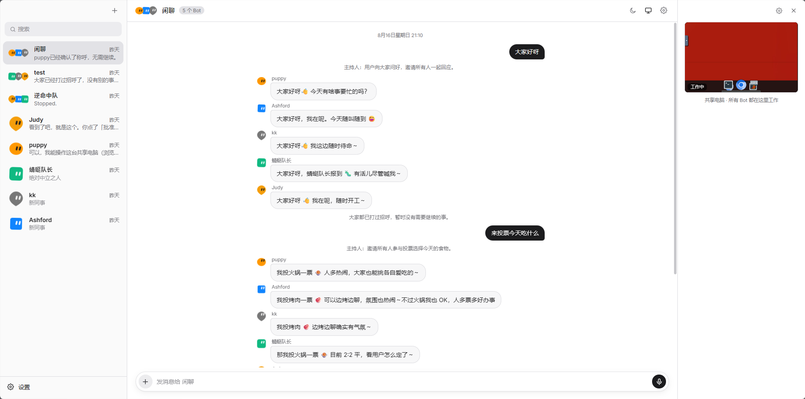

# Pibot

Pibot 是本地优先的多 Bot AI 工作台：每个 Bot 拥有独立的身份、记忆和会话，同时共享一台可见、可接管的 Docker 电脑。Agent 运行时基于 [pi-sdk](https://github.com/earendil-works/pi)（`@earendil-works/pi-coding-agent`），直接运行在宿主 Node 服务中；Docker 容器不运行 pi，只提供 Linux 桌面、Chromium、共享文件和电脑工具。Web UI 按 Grok Bot 的交互方式还原。



## 架构

对齐“整个账户一台共享电脑”：Agent 与电脑解耦。宿主服务直接维护每个 Bot 的
pi-sdk 会话、模型、MCP、审批和调度；共享电脑可以独立启动或停止，不影响 Bot
继续对话。电脑在线时，所有 Bot 共享桌面、Chromium 登录态和 `/config/workspace`，
并各自使用 `/config/bots/<id>/` 作为电脑内的私有目录。

```
浏览器 Web UI (React+Vite, 日常模式 8790 / 开发模式 5190)
   │  REST / WebSocket
宿主 Node 服务 server/ (Fastify, 8790)
   ├─ pi-sdk AgentSession × N   ← 私聊/群聊独立会话，直接在宿主进程运行
   ├─ 模型中转 / MCP / 审批 / 群聊编排 / 例行任务
   ├─ server/data               ← SQLite、pi 会话、模型状态、记忆缓存
   └─ ComputerAccess ── Docker API（命令、文件、电脑薄服务）
                              │
共享电脑容器 pibot-computer-shared（一台，所有 Bot 共用）
   ├─ computer-service.mjs    ← Playwright/CDP、浏览器操作、桌面截图
   ├─ XFCE 桌面 + KasmVNC    ← 共享屏幕，UI 内嵌观看/接管
   ├─ Chromium               ← 共享登录态，每个 Bot 使用独立页面
   └─ /config                ← 持久卷：workspace、Bot 私有目录和记忆
```

## 先决条件

- Windows + Docker Desktop（WSL2）、Node ≥ 20
- 一个第三方模型中转 API（支持 anthropic-messages / openai-completions / openai-responses 任一格式）

## 快速开始

```bash
# 1. 配置模型中转（复制模板后填写 baseUrl / apiKey / 模型名）
copy server\config.example.json server\config.json

# 2. 构建 Bot 容器镜像（首次较慢）
npm run image

# 3. 一键启动（日常使用）
npm start
```

`npm start` 会自动完成以下工作：

- 检查 Node 版本，并在依赖缺失或清单变化时执行 `npm install`；
- 校验 `server/config.json`、端口、Docker 和容器镜像；
- 重新构建 Web UI，避免提供过期的前端产物；
- 在单一端口 `http://localhost:8790` 提供 UI、API 和 WebSocket；
- 服务就绪后自动打开浏览器，按 `Ctrl+C` 可停止整组进程。

Docker Desktop 未运行或镜像尚未构建时，服务仍会以“电脑离线”模式启动；聊天界面可用，但桌面和浏览器工具暂不可用。

### 开发模式

首次进入开发模式前执行一次 `npm install`，然后分别在两个终端启动服务端和前端：

```bash
# 终端 1：服务端
npm run dev

# 终端 2：前端热更新
npm run dev:web
```

日常模式打开 http://localhost:8790，开发模式打开 http://localhost:5190，
点击左上角 "+" 创建第一个 Bot。
（Vite 端口固定为 5190 且 `strictPort`，被占用时会直接报错而不是漂移到别的端口。）

### 思考档位映射

模型配置里的“思考档位映射（JSON）”会原样接入 pi-sdk 的 `thinkingLevelMap`。
默认模板把七个档位与同名接口值一一对应。删除键会使用接口默认值，`null` 表示该档位不受支持。例如：

```json
{
  "off": "off",
  "minimal": "minimal",
  "low": "low",
  "medium": "medium",
  "high": "high",
  "xhigh": "xhigh",
  "max": "max"
}
```

## 目录

- `design-refs/` — 官方 UI 参照素材与设计基线（TOKENS.md）
- `server/` — 宿主编排服务：pi-sdk 会话、模型、MCP、审批、WebSocket、例行任务、SQLite
- `bot-image/` — 共享电脑镜像：XFCE、Chromium、KasmVNC 和 computer-service 薄服务（不含 pi）
- `web/` — Web UI（像素级还原 Grok Bot 桌面端）

## 添加 MCP package

在 `Settings → MCP → Add MCP server` 选择 `stdio`。npm package 通常填写：

- Command：`npx`
- Arguments：每行一个参数，例如 `-y`、`@scope/package`
- Environment：该 MCP 所需的环境变量 JSON

stdio MCP 在宿主机执行，工作目录固定为 `server/data/mcp-cwd`，不经过共享电脑容器。
因此只添加可信 package，并把敏感环境变量限制到最低范围。保存后点击 **Test connection**
发现工具，可逐项禁用；在 **Settings → Approvals** 配置 Require Approval / Always Allow。
Auto 策略会放行 MCP 标注的只读工具，写入或未知工具会在聊天中弹审批卡。

## 注意事项

- **务必用 `localhost` 访问 UI**。Bot 电脑面板内嵌的 KasmVNC 要求"安全上下文"：
  `http://localhost` 满足，换成局域网 IP 或其他主机名访问时，面板会显示
  "application requires a secure connection (HTTPS)"，桌面画面出不来。
- Docker Desktop 未运行时，宿主服务和聊天 UI 仍会降级启动，电脑面板显示“电脑离线”。
  启动 Docker Desktop 后点击离线电脑卡片即可重试，无需重启前后端服务。
- 容器内的脚本必须是 LF 行尾（仓库已通过 `.gitattributes` 约束，镜像构建时也会再规范化一次）。
- 模型不通时，Bot 不会沉默：失败原因会作为系统消息显示在会话里
  （例如 `No API key found` 或 `Connection error.`），据此排查中转配置。
